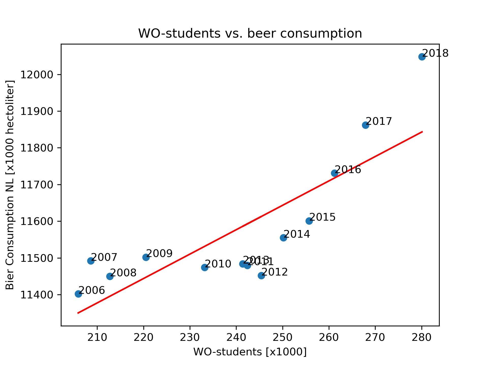

# Solution

Student ID: 14658704

## Papers
- MCC Van Dyke et al., 2019: Fantastic yeasts and where to find them: the hidden diversity of dimorphic fungal pathogens
- JT Harvey, Applied Ergonomics, 2002: An analysis of the forces required to drag sheep over various surfaces
- DW Ziegler et al., 2005: The neurocognitive effects of alcohol on adolescents and college students

## Plot

## Interpretation of Plot

There is a positive correlation between the number of WO students and beer consumption in the Netherlands between 2006 and 2018. A higher number of students corresponds to higher beer consumption. This does not mean that students are causing the rise in beer consumption. The data relates to total beer consumption in the Netherlands, not that of students. Both variables increase over time, meaning they could rise together due to a third factor, such as population growth.